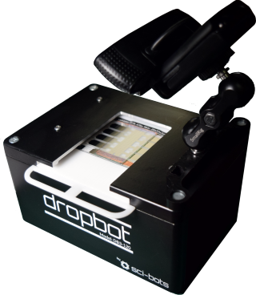

# DropBot v3

[This wiki](https://github.com/sci-bots/dropbot-v3/wiki/) contains documentation for the DropBot Digital Microfluidics (DMF) automation system. This is the latest generation DropBot instrument (v3) which makes many improvements over the previous hardware. These systems are available for purchase from [Sci-Bots](https://sci-bots.com/dropbot).

The original DropBot system was developed in the [Wheeler Lab at the University of Toronto](http://microfluidics.utoronto.ca/dropbot) and is described in detail in [Fobel et al., Appl. Phys. Lett. 102, 193513 (2013); doi: 10.1063/1.4807118](http://dx.doi.org/10.1063/1.4807118).

All hardware and software are open-source, subject to the [BSD-3-Clause license](https://github.com/sci-bots/microdrop/blob/master/LICENSE.md) (software code) or [Creative Commons Attribution-ShareAlike license](http://creativecommons.org/licenses/by-sa/3.0) (hardware designs).

If you have questions or feedback or would like to collaborate on the development of this project, please join our [community forum](https://forum.sci-bots.com). New users should checkout the [User Guide](https://github.com/sci-bots/dropbot-v3/wiki/UserGuide). If you're having problems with your DropBot, checkout the [Troubleshooting Guide](https://github.com/sci-bots/dropbot-v3/wiki/Troubleshooting).

